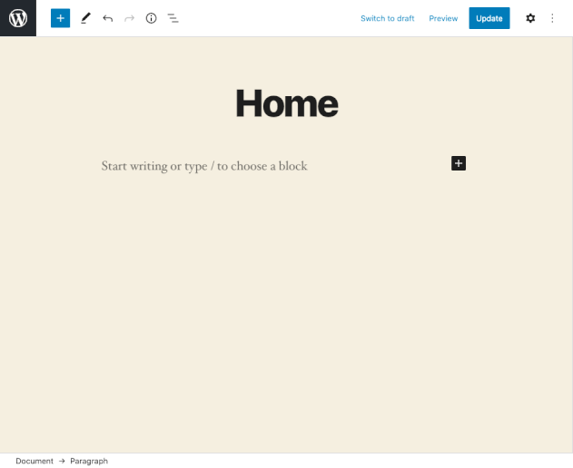

# Tabloid style grid editor for wordpress

1. Configurable via SASS variables
2. Custom blocks fully supported in Gutenberg wordpress visual editor
3. Block types: single post, twitter feed newest post
4. Requirements: siejmyamp theme + siejmycommon plugin

